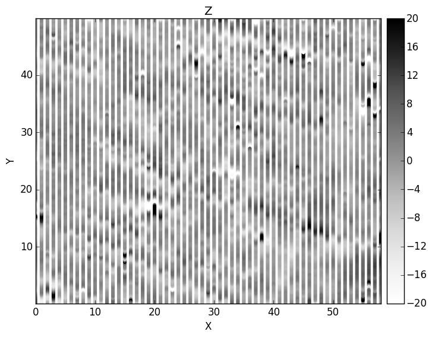
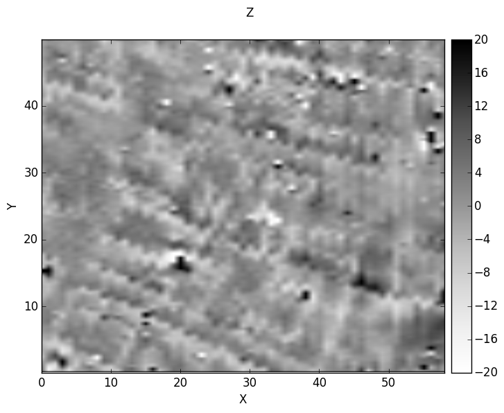

[](LICENSE)
[](https://pypi.org/project/GeophPy/)
[](https://pypi.org/project/GeophPy/)
[](https://pypistats.org/packages/geophpy)

`GeophPy` is an open source python package that offers tools for sub-surface geophysical survey data processing.

It mainly focuses on ground surveys data and offers tools to process the data and create geophysical maps that can be imported to GIS softwares.

`GeophPy` contains `general tools`, such as data destaggering, destriping and `method-specific tools`, such as reduction to the pole or magnetic data continuation.

<table>
  <tr>
    <td></td>
    <td></td>
    <td></td>
    <td></td>
  </tr>
</table>

Main Features
=============

* Build dataset from one or severals data files.
* Display geophysical maps in 2-D or 3-D.
* Processing datasets with `general` or `method-specific` geophysical processing step.
* Export processed datasets into georeferenced format compatible with any GIS.
* Compatible with Python 3.x.

The full online documentation can be found at: https://quentinvitale.github.io/GeophPy/

Installing
==========

`GeophPy` is distributed on the [PyPI]( <)https://pypi.org/project/GeophPy>) repository and you can install it using ``pip``.

```bash
# For most users, this is sufficient
pip install geophpy

# Or, for a more explicit install that ensures the correct Python environment
python -m pip install geophpy
```

See the `package documentation <https://quentinvitale.github.io/GeophPy>`_ for more details.

Feedback & Contribute
=====================

Your feedback is more than welcome.

If you would like to give a feedback or help improve this project, simply send an e-mail to 
lionel.darras@mom.fr, quentin.vitale@eveha.fr

Links
=====

**Package**

* Online documentation: https://quentinvitale.github.io/GeophPy/
* PyPI repository: https://pypi.org/project/GeophPy/

**GUI**

* `WuMapPy` online documentation: http://134.157.44.234/wumappydoc/
* `WuMapPy` PyPI repository: https://pypi.org/project/WuMapPy