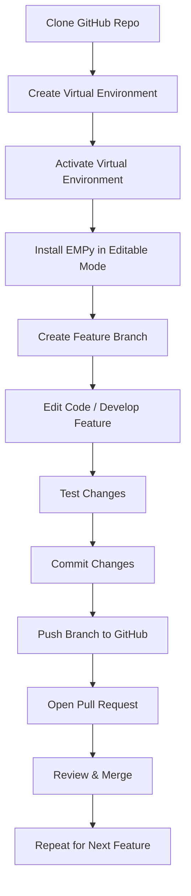

# GeophPy Workshop: Local Installation & Development Workflow

Welcome to the GeophPy workshop!  
This guide will help you set up your local development environment for GeophPy, install dependencies, and get ready to contribute and test your changes.

---

## Prerequisites

- **Python** (version 3.8 or higher recommended)
- **Git** installed on your computer
- **VS Code** (Visual Studio Code) for comfortable development (optional, but highly recommended)

---

## Step 1: Clone the GitHub Repository

Open a terminal (you can use VS Code’s integrated terminal) and run:

```bash
git clone https://github.com/QuentinVitale/GeophPy.git
cd GeophPy
```

or clone the repository directly from VScoce running the Git: Clone command in the Command Palette (Ctrl+Shift+P), or select the Clone Repository button in the Source Control view.


---

## Step 2: Open the Project in VS Code

- Start VS Code.
- Go to `File > Open Folder` and select the newly cloned `GeophPy` folder.

---

## Step 3: Create and Activate a Python Virtual Environment

**Create a Dedicated Project Folder:**

This keeps your dependencies isolated.

Create a Project Folder, as it's good practice to create a dedicated folder where you will use geophpy.


```bash
mkdir my_analysis_project
cd my_analysis_project
```
**Create and Activate a Virtual Environment:**

Then create and Activate a Virtual Environment to keeps your project's libraries isolated to prevent conflicts

```bash
python3.12 -m venv .venv
```

**Activate the environment:**

- On Windows:
  ```bash
  .venv\Scripts\activate
  ```
- On Mac/Linux:
  ```bash
  source .venv/bin/activate
  ```
 
---
To verify the virtual environment is activated, you should see "(.env)" message in the beginning of the terminal window (for exemple: "(.env) D:\Project>"). 

## Step 4: Editable Installation of GeophPy for developers

Install the package in "editable" mode so changes to code are instantly available.

This is the cleanest and most reliable method for setting up a development environment. It gives you full control over the code and is the standard practice for active development.

**Clone the repository:**


```bash
git clone https://github.com/QuentinVitale/GeophPy.git
```

**Navigate into the project directory:**

```bash
cd GeophPy
```

**Switch to the develop branch:**

```bash
git checkout develop
```

**Install the package in editable mode:**

```bash
pip install -e .
```

## Step 5: Install Jupyter Notebook

If you want to use interactive notebooks for tutorials and exploration:

**Approach 1: Install Jupyter in Every venv (Simple & Safe)**

```bash
pip install jupyterlab notebook
```

**Approach 2: Use a Single Jupyter Installation with Kernels**

Of course. Here is the tutorial in English and formatted in Markdown.

How to Use Jupyter with Virtual Environments

There are two main approaches to using Jupyter with your project's virtual environment (venv).

## Approach 1: Install Jupyter in Every venv (Simple & Safe) 📚

This method is the most straightforward and recommended for ensuring your project is completely self-contained and reproducible.

Why it's recommended:

    Dependency Isolation: Your project uses a specific version of Jupyter and its dependencies. Another project might need a different version. Installing Jupyter in separate venvs prevents any conflicts.

    Reproducibility: If you share your project, another person can recreate the exact working environment, including the correct Jupyter version, simply by installing packages from a requirements.txt file.

    Simplicity: It's the most direct method. Once your venv is activated, you install and run Jupyter, and everything works without extra configuration.

Bash

# Once the venv is activated
pip install jupyterlab notebook
jupyter-lab

## Approach 2: Use a Single Jupyter Installation with Kernels 🌍

This involves having one central Jupyter installation that can access and use the packages from your various project environments.

Only the ipykernel package is  installed inside each project's venv, which makes that environment available as a "kernel" to your main Jupyter installation.

```bash
pip install ipykernel
```
Register this venv as a kernel for Jupyter to find:
```bash
python -m ipykernel install --user --name="geophpy-dev" --display-name "Python (geophpy-dev)"
```

---

## Step 6: Create Your Own Branch for Development

Never work directly on `main`! Create a feature branch for your work:

```bash
git checkout main
git pull
git checkout -b your-feature-branch
```

Replace `your-feature-branch` with a descriptive name (e.g., `notebook-tutorial`).

---

## Step 7: Start Coding & Testing

- Edit code files, create notebooks, and run experiments.
- Use the virtual environment for all commands and tests.
- Test your changes with `import geophpy` in Python or a notebook.

---

## Step 8: Commit and Push Your Work

1. Stage and commit your changes:

    ```bash
    git add .
    git commit -m "Describe your changes here"
    ```

2. Push your branch to GitHub:

    ```bash
    git push origin your-feature-branch
    ```

---

## Step 9: Open a Pull Request

On GitHub, open a Pull Request to merge your branch into `main`.  
This allows for code review and collaboration.

---

## Visual Workflow Diagram

You can visualize the typical workflow with this Mermaid diagram (works in Markdown on GitHub, VS Code, Obsidian, etc.):



---

## Troubleshooting

- If you have issues with dependencies, try `pip install --upgrade pip` and repeat the installation steps.
- If Python or Git are not recognized, check your PATH or reinstall.
- For any EMPy-specific issues, open an Issue on GitHub or ask your instructor.

---

Happy coding, and welcome to the GeophPy workshop!